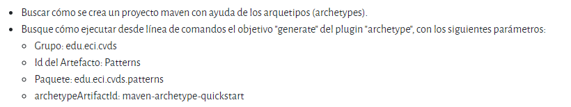

# LABORATORIO 2 - PATTERNS - 2022-1
# TALLER 2
# PATTERNS - FACTORY
# LA HERRAMIENTA MAVEN

La herramienta Apache Maven se usa para gestionar y manejar proyectos de software. La base de maven para un poyecto es el concepto de un modelo de objeto de proyecto (POM), Maven puede gestionar la compilación, los informes y la documentación de un proyecto a partir de este modelo, que se concreta en el archivo pom.xml.

Ingresar a la página de la herramienta y entender:


## Mayor utilidad:
Es capaz de construir, reportar y documentar desde una pieza de informacion central
## Fases de Maven:
1.validate

2.compile

3.test

4.package

5.verify

6.install

7.develop 

## Ciclo de vida de la construccion:
* Ciclo de vida default, que gestiona la construccion y despliegue del proyecto.
* Ciclo de vida clean, que gestiona la limpieza del directorio del proyecto.
* Ciclo de vida site, que gestiona la creacion de la documentacion del proyecto.
## Para que sirven los pluggins:
Son un marco de trabajo de ejecucion de pluggin, especialmente bueno para la execucion.
## Maven y repositorio central Maven:
Maven es una herramienta que puede ser usada para construir y manejar cualquier projecto basado en Java.
El repositorio central de Maven sirve para aquellos que necesiten dependencia por sus propias construcciones o proyectos que quieran que sus lanzamientos esten en el repositorio central    


# CREAR UN PROYECTO CON MAVEN

Ejecutando el conjunto de instrucciones dado:


Por medio del siguiente codigo:

```
mvn archetype:generate -DgroupId=edu.eci.cvds -DartifactId=Patterns -DarchetypeArtifactId=maven-archetype-quickstart -Dpackage=edu.eci.cvds.patterns -DinteractiveMode=false 

```
* Objetivo del comando `package`: Crea un archivo JAR o WAR para convertir el proyecto en formato distribuible

Con el codigo `mvn exec:java -Dexec.mainClass="edu.eci.cvds.patterns.App" -Dexec.args="argument1"`
ejecutamos el proyecto maven.

El parametro `-Dexec.args` nos permite configurar los parametros que se envian al ejecutar el projecto maven